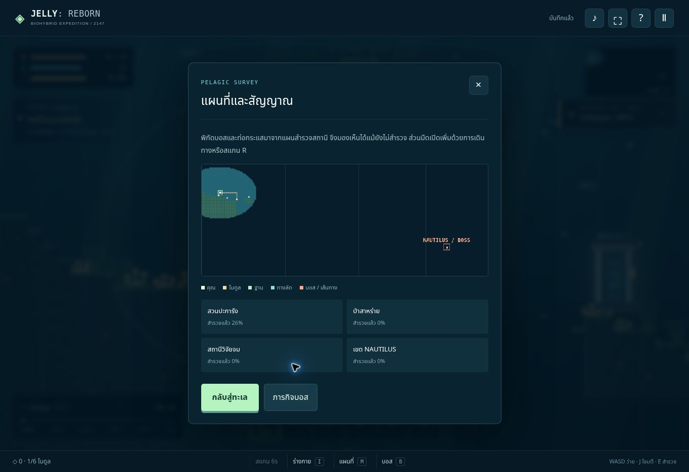

# Release 02 verification · 2026-10-07

`node jellyfish/tests/engine.test.cjs` — **26 checks passed**.

The engine checks cover the six-stage timeline, stationary polyps and cysts,
cyst-to-polyp reversal, death backup, v1 save migration, all six weapons,
boss gating and phases, rewards, storage, pause behaviour, sonar energy and
cooldown, terrain clearance and continuous navigation.

A simulated player followed the actual mission route from a new save, collected
the first module, waited for development, used the express tube and entered the
boss encounter after approximately **57 seconds**. This test swims with the same
movement and collision functions as the game; it does not teleport to objectives.

Canvas output was rendered with Skia at desktop, portrait and landscape engine
sizes. The browser UI was checked separately on the deployed GitHub Pages page:

- Loaded an existing browser save with the Release 02 code.
- Checked the gameplay HUD, environmental telemetry and navigation arrow.
- Used the scanner and observed its energy use, cooldown and expanded map.
- Opened the mission through the footer button and the B key.
- Opened the full map and verified that NAUTILUS / BOSS appears in unexplored water.

The browser verification uses cloud Chromium on a desktop viewport. Mobile engine
size checks are simulated; physical phone input and device performance have not
been tested. The Node tests stub drawing and verify game rules, not browser layout.
